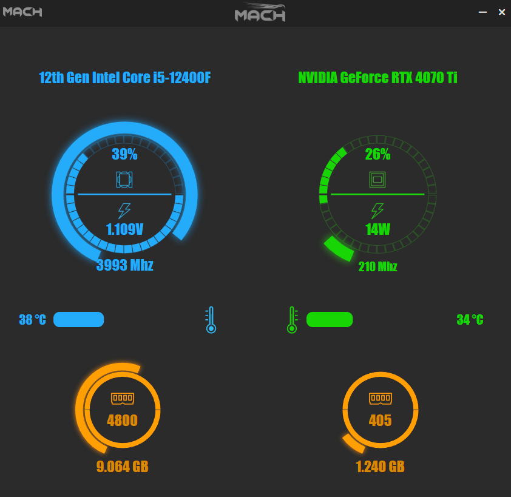

# MACH - Hardware Monitoring App

**Overview**

MACH is a hardware monitoring application that displays real-time performance metrics of essential computer components, including the processor, graphics card, RAM, and more. With a user-friendly interface and customizable themes, MACH helps you keep track of your computer's health.

---

 

---

**Features**

- Displays processor and graphics card clock speed, usage, temperature, and voltage information.
- Shows real-time RAM frequency and the amount of active RAM in use.
- Provides details on the brand and model of the processor and graphics card.
- Features a red-themed interface for AMD processors, blue-themed for Intel processors.
- Utilizes green-themed interface for NVIDIA graphics cards, and red-themed for AMD graphics cards.
- Sleek and user-friendly UI design.

---

 

---
Technologies and Development Stages

MACH has been developed using Electron JS and C#.

Frontend (Electron JS):
- User interface design based on HTML, CSS, and JS.
- Seamless integration of SVG-based indicators.
- Custom parser developed to appropriately place scattered data into the corresponding indicators.
- Loading color themes based on AMD or Intel processor, NVIDIA or AMD graphics card.

Backend (C#):

- C# application for real-time hardware and sensor data collection.
- Integration of a WebSocket server for transmitting data to the Electron application.

---

 

---

**Sımply Download**
[Download mach-v0.1.1-pre-alpha](https://github.com/tahsinkoc/mach/releases/tag/mach-v0.1.1-pre-alpha)

**NOTES**
- Optimization of the parser may still be in development.
- I still have some issues with certificates in Windows.
- I'm open to ideas to solve these problems or improve the app.

Developer

Tahsin Özgür KOÇ 
tahsinkocw@gmail.com

UI Components designed by Ünsal KOÇ

